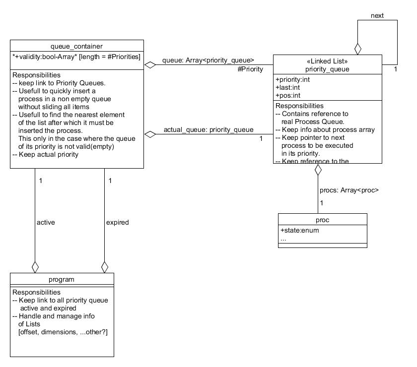
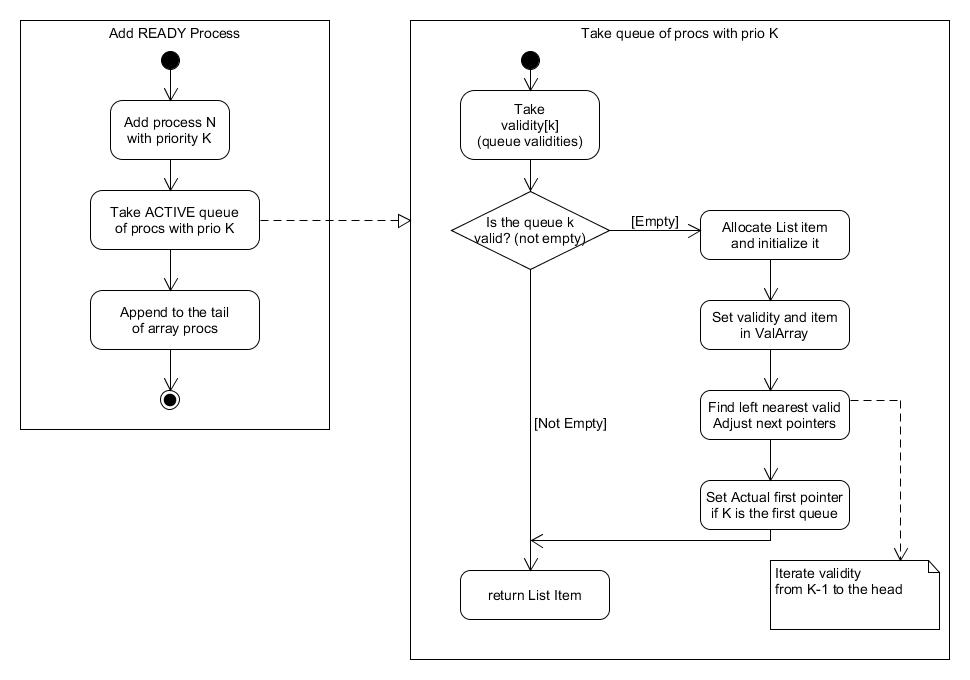
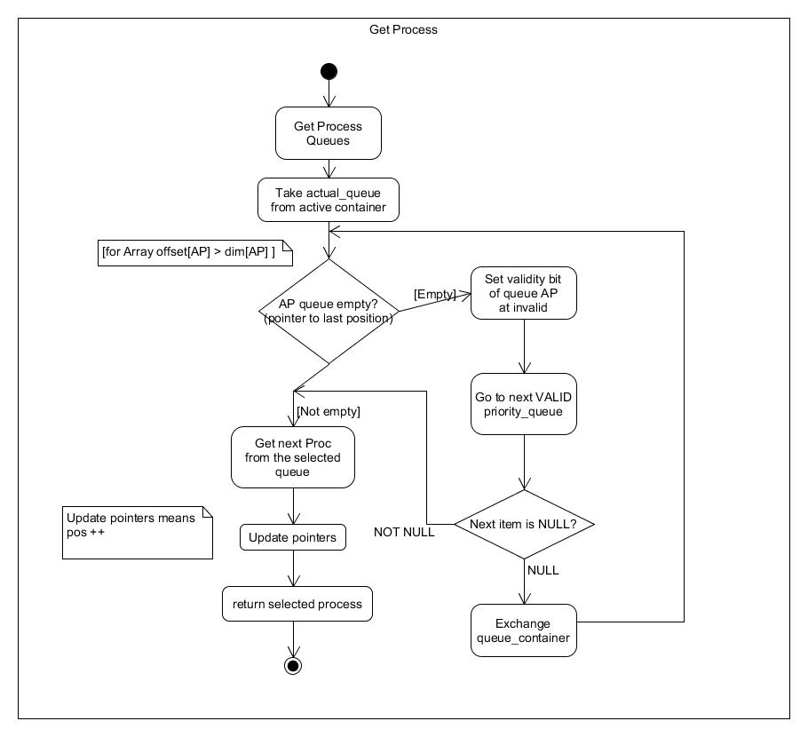

## Operating Systems Course - DIEF UNIMORE

In this exercise we will see how to implement an **O(1) scheduler** for xv6.

## What is it?
As wikipedia clearly explains ([here](https://en.wikipedia.org/wiki/O(1)_scheduler#Improvement_in_Linux_Scheduler_Performance)):
> O(1) Scheduler does not contain any algorithms that run in worse than O(1) time. That is, every part of the scheduler **is guaranteed to execute within a certain constant amount of time regardless of how many tasks are on the system.** This allows the [Linux kernel](https://en.wikipedia.org/wiki/Linux_kernel "Linux kernel") (xv6 kernel) to efficiently handle massive numbers of tasks without increasing overhead costs as the number of tasks grows. There are two key data structures in the Linux 2.6.8.1 (O(1)) scheduler that allow for it to perform its duties in O(1) time, and its design revolves around them - [runqueues](https://en.wikipedia.org/wiki/Run_queue "Run queue") and priority arrays.

## Algorithm
A clear explanation of how this scheduler algorithm works is provided [in this video](https://youtu.be/vF3KKMI3_1s?t=349) 

If you are really triggered with this topic you can find an in-depth analysis [at this page](https://www.slideshare.net/roylee17/linux-o1-scheduling)

## Implementation
Now that everything should be clear we can start to devise the implementation in an high level of programmation such as use case and activity Diagram. 

In this picture it's shown the structs used and their relations

So now we can start to insert a process

And the least activity diagram about how to get the next process

So, now that everything looks quite clear let's get some confusion jumping into the code! ;)

## Implementation details

All the functions created are in proc.c at the end of the file starting from initQueueContainer(). The struct are defined at the head of the file.
A good way to explore the code is to see the sequence of the calls while examining it.

1. First of all see the initialization's calls in pinit. (initQueueContainer)

2. Then spot where insertActive() and insertExpired() are used, try to explore them!

3. At the end analize getNextProc() call in scheduler()

## Test & Other function
In this exercise they've been inserted from previus labs:

* ps.c

* nice.c

* test_scheduler.c

These functions allows us to test the scheduler.
In the file test.txt you can find a few test scripts.

## Author: Andrea Baraldi
Have fun! 
Good Work!